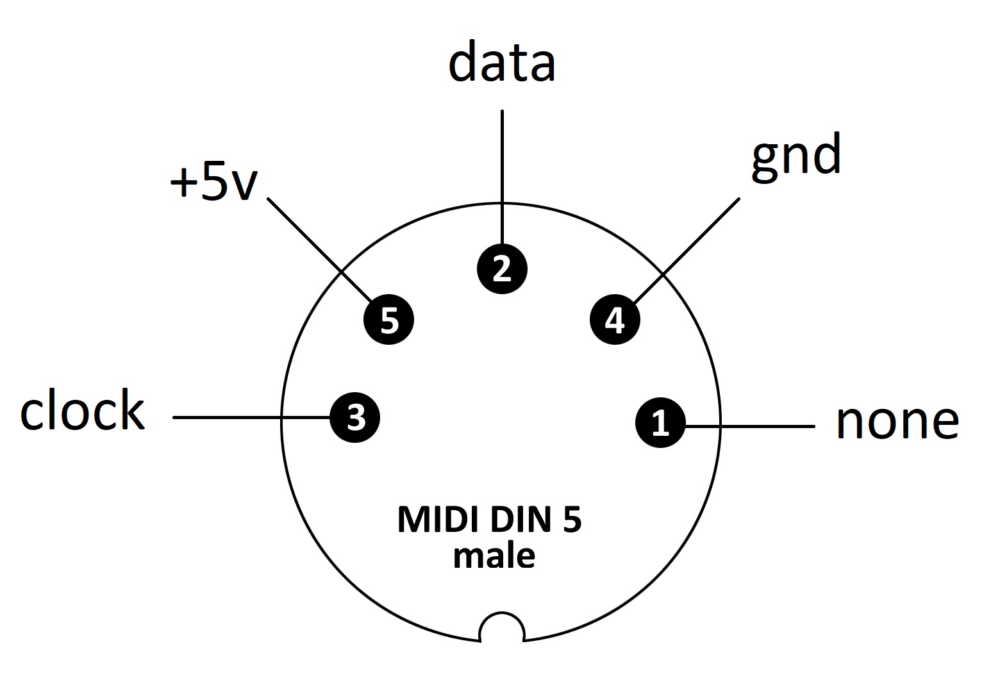
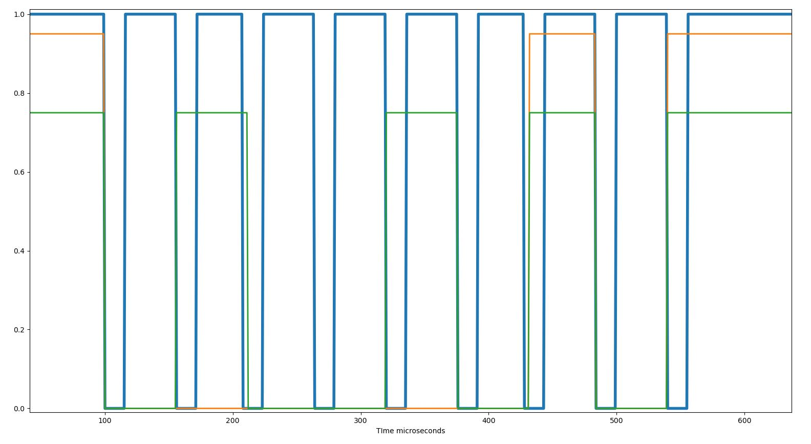

### keyboard MERA-REFA KL-13

    DC +5V 0.28A K2 Z4 ll N
    ZN-87/REFA-095
    NR 00346
    MADE IN POLAND

    Klawiatura MERA-REFA KL-13
    Mazovia 1016, Polish PC XT

### keyboard.ino - driver vith terminal output

    Attach  keyboard data (pin 2) to arduino pin 2
    Attach  keyboard clock(pin 3) to arduino pin 3
    Attach  keyboard vcc (pin 5) to arduino pin 5
    Attach  keyboard gnd (pin 4) to arduino pin gnd

### protocol analysing 
     https://github.com/DenisSouth/log_analyzer
     two_channel.ino

